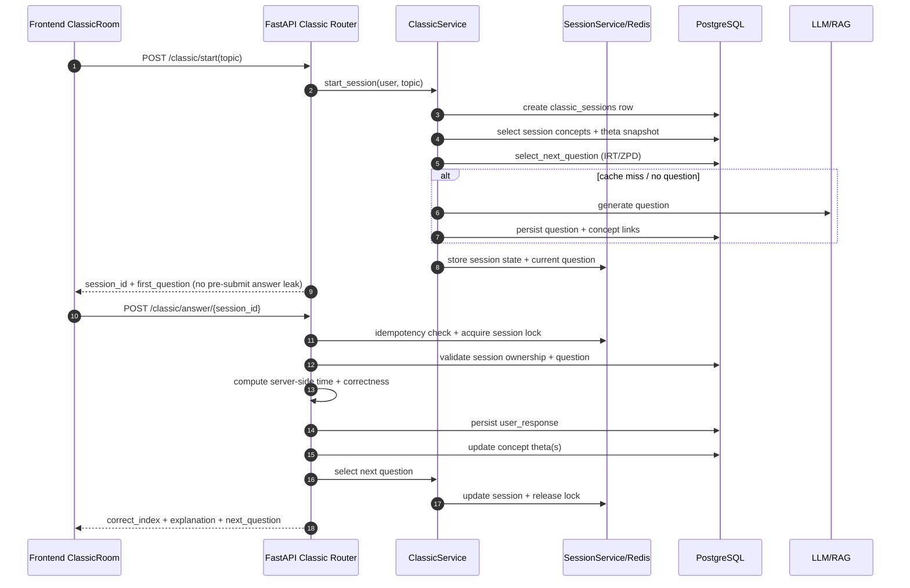

# AdaptIQ Technical Deep Dive

Date: 2026-04-08

## 1. Executive Technical Summary

AdaptIQ is an adaptive learning and competitive quiz platform with two distinct but coexisting runtime engines:

- Classic Room (learning-first): concept-level adaptation using 1PL IRT with per-concept theta tracking.
- Challenge Room (competition-first): rank progression, level access constraints, streak-triggered level changes, and points-based rank advancement.

The stack is:

- Backend: FastAPI + SQLAlchemy async + PostgreSQL + Redis + Groq LLM.
- Frontend: React 19 + TypeScript + Vite + Tailwind.

The architecture combines persistent state (PostgreSQL), volatile execution/session state (Redis), and probabilistic/adaptive logic (IRT + concept heuristics).

---

## 2. Runtime Architecture

### 2.1 Backend lifecycle

Backend startup behavior in `backend/main.py`:

- Configures logging and structlog.
- Validates security-critical config (DB/Redis credentials, JWT strength, production safeguards).
- Creates async DB engine/session factory and runs `Base.metadata.create_all`.
- Attempts auto-seed if concept table is empty.
- Connects Redis.
- Creates shared HTTP client.
- Asynchronously preloads HuggingFace dataset.
- Mounts routers: system, auth, classic, challenge.

Operationally, backend uses app-state singletons for:

- `db_engine`, `db_session_factory`
- `redis`
- `http_client`
- `limiter` (SlowAPI)

### 2.2 Frontend app shell

Frontend route topology in `frontend/src/App.tsx`:

- Public pages: Home/Login/Signup/Forgot/Reset.
- Protected pages: Dashboard, Profile, ClassicRoom, ChallengeRoom, ConceptMastery.
- `AuthProvider` loads JWT from localStorage, validates via `/api/auth/me`, and gates route access.

---

## 3. Core Domain Model

Primary entities in `backend/database/models.py`:

- Users and auth profile:
	- `users`
- Learning telemetry:
	- `user_responses`
	- `classic_sessions`
- Question inventory:
	- `question_bank`
- Concept graph and mastery:
	- `concepts`
	- `question_concepts`
	- `user_concept_theta`
	- `user_concept_repeat_queue`
- Competitive mode:
	- `challenge_ranks`
	- `user_challenge_rank`
	- `challenge_matches`
	- `challenge_sessions`
	- `challenge_answers`

This schema supports both pedagogical adaptation and ranked competition without requiring one mode to depend on the other’s session mechanics.

---

## 4. Authentication and Security Design

Auth internals are centered in:

- `backend/auth/core/security.py`
- `backend/auth/core/dependencies.py`
- `backend/auth/services/auth_service.py`
- `backend/routers/auth.py`

Key mechanisms:

- BCrypt password hashing via async thread offload (`asyncio.to_thread`).
- JWT access token with claims: `sub`, `exp`, `iat`, `jti`.
- Redis-backed token revocation watermark (`auth:revoked_after:{user_id}`).
- Endpoint-level rate limiting:
	- login/register/reset flows are protected by Redis counters and TTL windows.
- Optional dev bypass token for testing (`dev-bypass-{user_id}`) guarded by environment flag.

Security tradeoff currently present:

- If Redis is unavailable, token revocation check degrades gracefully and permits tokens (availability-first decision).

---

## 5. Adaptive Learning Theory and Implementation

### 5.1 IRT model used

In `backend/database/irt.py`, the system uses the 1-Parameter Logistic model:

$$
P(\text{correct}|\theta,\beta)=\frac{1}{1+e^{-(\theta-\beta)}}
$$

Where:

- $\theta$: user ability estimate
- $\beta$: question difficulty estimate

Online theta update (gradient-style):

$$
	heta_{new}=\theta+\alpha\cdot(\mathbf{1}_{correct}-P)
$$

with clamping to a bounded range.

### 5.2 Concept-level adaptation

In `backend/database/concept_irt.py`, theta is tracked per concept, not globally:

- Each `(user, concept)` has:
	- theta
	- variance
	- response_count
	- exposure metadata

This enables a user to be advanced in one concept and beginner in another simultaneously.

### 5.3 ZPD targeting

Question targeting uses a zone intended to keep challenge moderate (roughly 60% to 75% success probability), converting target ability windows to beta ranges.

### 5.4 Warm-up confidence logic

During early responses (few data points), concept confidence is low. The system broadens difficulty range to avoid overfitting early lucky/unlucky answers.

### 5.5 Inactivity decay

`backend/services/decay_service.py` applies temporal decay to stale concept theta values:

$$
	heta' = \theta \cdot (1-d)^k
$$

Where $d$ is decay factor and $k$ is elapsed decay periods. Variance increases as confidence erodes over inactivity.

---

## 6. Classic Room End-to-End Lifecycle

Classic has both legacy V1 and session-based V2 APIs in `backend/routers/classic_room.py`. Frontend primarily uses V2 from `frontend/src/pages/ClassicRoom.tsx`.

### 6.1 V2 request flow

- Start session: `POST /api/rooms/classic/start`
- Submit answer: `POST /api/rooms/classic/answer/{session_id}`
- Hint: `POST /api/rooms/classic/hint/{session_id}`
- Metrics: `GET /api/rooms/classic/metrics/{session_id}`

### 6.2 Critical safeguards

- Session ownership checks before mutation.
- Idempotency cache for duplicate submissions.
- Session lock to prevent race conditions.
- Server-side timing calculation (do not trust client-provided elapsed time).

### 6.3 Sequence diagram



---

## 7. Challenge Room End-to-End Lifecycle

Challenge mode in `backend/routers/challenge.py` currently contains three overlapping API families:

- V1: basic match/rank endpoints
- V2 match-based endpoints (`/v2/start`, `/v2/answer/{match_id}`, `/v2/end/{match_id}`)
- MHD-style V2 endpoints (`/v2/generate-question`, `/v2/submit-answer`, `/v2/session/{id}/end`)

Frontend `ChallengeRoom.tsx` uses MHD-style service calls (`frontend/src/services/challengeService.ts`).

### 7.1 Competitive theory in code

- Rank defines allowed levels.
- Points table defines per-level reward/penalty.
- Correct streak threshold triggers level-up, wrong streak threshold triggers level-down.
- Level transitions are clamped by rank’s allowed level window.
- Session points roll up into global rank points; rank can change post-session.

### 7.2 Data-flow diagram

```mermaid
flowchart TD
		A[ChallengeRoom UI] --> B[/v2/status\ngetUserRank]
		B --> C[UserChallengeRank + ChallengeRank]

		A --> D[/v2/start\nstart session]
		D --> E[Create ChallengeMatch]
		D --> F[Create ChallengeSession]
		D --> G[Store runtime state in Redis]

		A --> H[/v2/generate-question]
		H --> I[LLM question generation]
		I --> J[Persist QuestionBank]
		J --> K[Return question + points value]

		A --> L[/v2/submit-answer]
		L --> M[Server-side answer verification]
		M --> N[Points change from level table]
		N --> O[Update streaks]
		O --> P{streak trigger?}
		P -- yes --> Q[Apply rank-bounded level change]
		P -- no --> R[Keep level]
		Q --> S[Record ChallengeAnswer]
		R --> S
		S --> T[Update ChallengeSession counters]

		A --> U[/v2/session/{id}/end]
		U --> V[Finalize ChallengeSession]
		V --> W[Update UserChallengeRank global points/win-loss]
		W --> X[Compute possible rank change]
		X --> Y[Return end summary]
```

---

## 8. Session, Caching, and Consistency Strategy

`backend/services/session.py` centralizes volatile state:

- Session payloads (`session:*` and `state:*` namespaces)
- Current-question snapshots
- Idempotency entries
- Session lock keys with TTL
- In-memory fallback for local/dev if Redis unavailable

Consistency controls:

- Exactly-once-ish submission behavior via idempotency keying.
- Locking around critical answer updates.
- State TTL refresh on updates.

---

## 9. LLM and RAG Strategy

### 9.1 Classic LLM

`backend/services/llm.py`:

- Generates MCQs with strict JSON schema.
- Option shuffling prevents static correct position bias.
- Hint generation includes anti-answer-reveal prompt and guard.

### 9.2 Challenge LLM

`backend/services/challenge_llm.py`:

- Level-specific prompt semantics (option count/plausibility/free-text prep).
- Retry and fallback to lower level if generation fails.

### 9.3 RAG usage

- Classic and higher challenge levels can leverage RAG context if available.
- Failure is generally non-fatal; system falls back to direct LLM generation.

---

## 10. Frontend State Machines

### 10.1 ClassicRoom

In `frontend/src/pages/ClassicRoom.tsx`:

- States: selection -> quiz -> summary
- Timer-driven auto-submit on timeout
- Shows explanation only after submission
- Uses backend authoritative correctness (`correct_index`) and session progression (`next_question`)

### 10.2 ChallengeRoom

In `frontend/src/pages/ChallengeRoom.tsx`:

- States: loading -> selection -> quiz -> summary
- Tracks rank points, streaks, and level transitions in local session state
- Shows forced level-change popups
- Ends session and refreshes rank to detect promotions

---

## 11. Monitoring, Observability, and Ops

- In-memory monitoring service for API stats, recent errors, and rate-limit events: `backend/services/monitoring.py`.
- Health endpoints in `backend/routers/system.py` include basic and detailed checks (DB/Redis latency and LLM config visibility).
- Request logging middleware emits request IDs and duration.

Potential bug to verify:

- `get_remote_address` appears used in `backend/main.py` without a local import in that file; this should be validated in runtime/import tests.

---

## 12. Test Posture

Representative test suites observed:

- Classic API behavioral checks: `backend/tests/test_classic_room_api.py`
- Challenge route and rule checks: `backend/tests/test_challenge.py`
- Concept adaptation checks: `backend/tests/test_concept_awareness.py`
- Adaptive behavior tests with seeded users: `backend/tests/test_adaptive_behavior.py`

Coverage strengths:

- Security assertions (no pre-submit answer leakage in V2).
- IRT math convergence sanity checks.
- Concept-level ability separation validation.

Known gaps:

- Some challenge tests are skipped due to integration prerequisites.
- Multiple challenge contracts increase test matrix complexity.

---

## 13. Endpoint Cleanup and Deprecation Map

Current state indicates challenge API contract overlap. A controlled cleanup plan:

### Phase A: Canonical contract decision

- Choose one challenge API family as canonical (recommended: MHD-style V2 currently used by frontend).
- Freeze additional feature work on non-canonical families.

### Phase B: Adapter compatibility layer

- Keep old endpoints operational but internally route to canonical service functions.
- Emit deprecation headers and warning logs on legacy calls.

### Phase C: Frontend and SDK hardening

- Ensure all frontend challenge calls use one service module and one type source.
- Remove parallel legacy types once migration is complete.

### Phase D: Removal

- Remove unused challenge endpoints in one release after telemetry confirms no legacy consumers.
- Prune dead tests and duplicate DTOs.

### Suggested deprecations (after migration validation)

- Challenge V1 endpoints under `/api/rooms/challenge/*` that overlap with V2 behavior.
- Match-ID V2 flow if MHD-style session flow remains canonical.

---

## 14. Strengths, Risks, and Technical Debt

### Strengths

- Concept-level adaptive architecture with explicit probabilistic modeling.
- Good practical safeguards: idempotency, lock-based race prevention, server-side timing.
- Clear separation of learning mode vs competitive mode data constructs.

### Risks

- Challenge endpoint family sprawl and contract drift risk.
- Mixed fallback semantics around Redis availability in auth revocation path.
- Runtime import/consistency pitfalls in large merged router files.

### Technical debt

- Consolidate challenge router into smaller modules.
- Normalize DTO/type ownership to a single source per mode.
- Strengthen e2e coverage for deprecation transition paths.

---

## 15. Quick Glossary

- Theta ($\theta$): user ability estimate.
- Beta ($\beta$): question difficulty estimate.
- ZPD: Zone of Proximal Development; target challenge band.
- Concept mastery: per-concept theta profile per user.
- Idempotency key: duplicate request suppression token.
- Session lock: per-session mutual exclusion for critical updates.
- Rank points: cumulative challenge progression points.

---

## 16. Recommended Next Technical Actions

1. Unify Challenge API surface to one canonical contract and deprecate others with telemetry.
2. Add import/runtime health test that catches unresolved middleware symbols early.
3. Add end-to-end tests covering full challenge loop on canonical APIs only.
4. Document strict backend/frontend contract tables (request/response examples) for Classic and Challenge V2.

