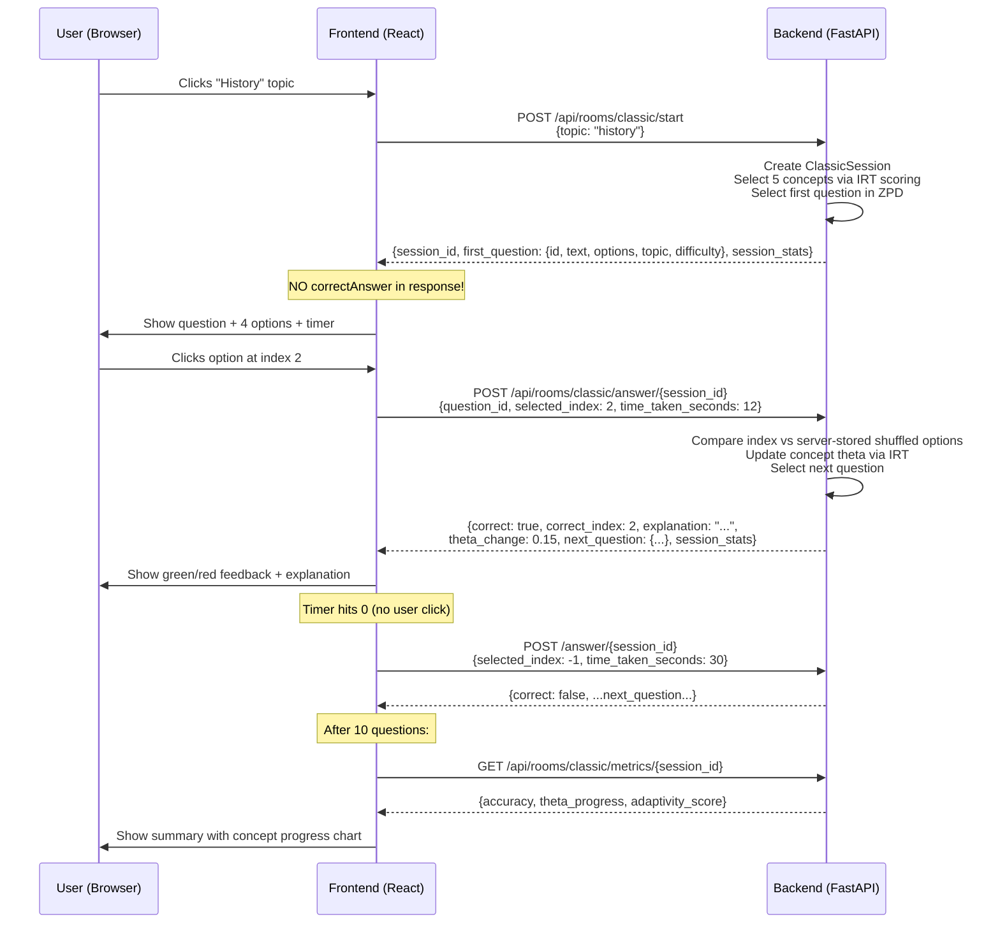

# AdaptIQ — Complete Fix Plan + Frontend Design + Adaptive Testing Scenarios

---

## Part 1: Additional Errors Found (Deep Pass)

Beyond the original 32 issues, deep review of [seed.py](file:///c:/Users/mns/Desktop/pfe_auth/backend/seeds/seed.py), [rag/agentic.py](file:///c:/Users/mns/Desktop/pfe_auth/backend/rag/agentic.py), [auth_service.py](file:///c:/Users/mns/Desktop/pfe_auth/backend/auth/services/auth_service.py), [Dashboard.tsx](file:///c:/Users/mns/Desktop/pfe_auth/frontend/src/pages/Dashboard.tsx), and all test/e2e files uncovered these:

### 🔴 33. Seed Data Topic Casing Mismatch
**File:** [seed.py](file:///c:/Users/mns/Desktop/pfe_auth/backend/seeds/seed.py#L704-L760)

Concepts are seeded with **lowercase** (`topic="geography"`, `topic="history"`) but questions are seeded with **title-case** (`topic="Geography"`, `topic="History"`). This means V2 queries joining questions to concepts by topic will fail.

### 🔴 34. RAG Validator Uses [simple_completion](file:///c:/Users/mns/Desktop/pfe_auth/backend/services/llm.py#181-189) (10 Tokens)
**File:** [agentic.py](file:///c:/Users/mns/Desktop/pfe_auth/backend/rag/agentic.py#L303)

The [ValidatorAgent](file:///c:/Users/mns/Desktop/pfe_auth/backend/rag/agentic.py#181-213) calls `llm_client.simple_completion(validation_prompt)` which limits to 10 tokens. The validator prompt asks for "YES" or "NO" but the LLM often adds preamble that gets truncated, making validation unreliable.

### 🔴 35. RAG HF Path Leaks `correctAnswer`
**File:** [agentic.py](file:///c:/Users/mns/Desktop/pfe_auth/backend/rag/agentic.py#L256-L266)

When RAG uses the HuggingFace dataset path, it returns `"correctAnswer"` in the question dict — same leak as V1 endpoints.

### 🟡 36. [forgot_password](file:///c:/Users/mns/Desktop/pfe_auth/backend/auth/services/auth_service.py#92-110) Returns Email in Response
**File:** [auth_service.py](file:///c:/Users/mns/Desktop/pfe_auth/backend/auth/services/auth_service.py#L107-L108)

Response includes `"email": email` and `"purpose": OTP_PURPOSE_PASSWORD_RESET`. While the function correctly says "If an account exists...", returning the email confirms it was processed. Remove both fields.

### 🟡 37. All E2E Tests Mock V1 Endpoints
**File:** [classic-room-flow.spec.ts](file:///c:/Users/mns/Desktop/pfe_auth/frontend/e2e/classic-room-flow.spec.ts#L40-L52)

Playwright tests mock `/api/rooms/classic/questions` with `correctAnswer` in the response. After V2 migration, all e2e tests must be rewritten.

### 🟡 38. No Backend Tests for V2 Endpoints
**Observation:** [test_classic_room_api.py](file:///c:/Users/mns/Desktop/pfe_auth/backend/tests/test_classic_room_api.py) only tests V1 endpoints. The V2 `/start`, `/answer/{session_id}`, `/hint/{session_id}` endpoints have zero test coverage.

### 🟡 39. `random.seed()` Called in Seed Loop
**File:** [seed.py](file:///c:/Users/mns/Desktop/pfe_auth/backend/seeds/seed.py#L949)

`random.seed(hash(...))` inside the response generation loop reseeds the global random generator for every response. This makes every other `random.random()` call in the app deterministic during seeding — harmless for seeding itself, but if the seed runs during an active app (e.g., called from an admin endpoint), it corrupts randomness for concurrent quiz sessions.

### 🟠 40. Dashboard "Active Rooms" Is Hardcoded
**File:** [Dashboard.tsx](file:///c:/Users/mns/Desktop/pfe_auth/frontend/src/pages/Dashboard.tsx#L167-L189)

The rooms list is hardcoded with `isLocked: true` for "Exam Simulation" and no navigation link actually goes to `/rooms/challenge`. Dashboard cards don't link anywhere — they're just display.

### 🟠 41. [conftest.py](file:///c:/Users/mns/Desktop/pfe_auth/backend/tests/conftest.py) Spins Up Real Lifespan (DB + Redis)
**File:** [conftest.py](file:///c:/Users/mns/Desktop/pfe_auth/backend/tests/conftest.py#L18)

Tests use `app.router.lifespan_context(app)` which connects to the **real** PostgreSQL and Redis. No test database isolation. Tests mutate production data.

### 🟠 42. [ensure_schema()](file:///c:/Users/mns/Desktop/pfe_auth/backend/seeds/seed.py#42-208) Bypasses Alembic
**File:** [seed.py](file:///c:/Users/mns/Desktop/pfe_auth/backend/seeds/seed.py#L42-L58)

The seed script calls `Base.metadata.create_all` AND runs raw `ALTER TABLE` statements. This shadow migration system competes with Alembic and can create schema states that Alembic doesn't track.

---

## Part 2: How the Frontend Should Be Implemented (V2 Migration)

### Current Frontend Architecture

```
App.tsx
├── AuthContext (login/signup/logout, JWT storage)
├── PublicRoute / ProtectedRoute guards
├── pages/
│   ├── Home.tsx        — Landing page
│   ├── Login.tsx       — Email + password form
│   ├── Signup.tsx      — Registration form
│   ├── Dashboard.tsx   — Stats, charts, room cards
│   ├── ClassicRoom.tsx — Quiz flow (V1 — BROKEN)
│   ├── ForgotPassword / ResetPassword
│   └── (MISSING: ChallengeRoom, Profile)
├── components/
│   ├── InternalLayout.tsx — Sidebar + navbar wrapper
│   └── ConceptMastery.tsx — Concept theta visualization
└── services/
    └── apiService.ts — All API calls (V1)
```

### Target Frontend Architecture (V2)

```
App.tsx
├── AuthContext (unchanged — works fine)
├── pages/
│   ├── Home.tsx            — unchanged
│   ├── Login / Signup      — unchanged
│   ├── Dashboard.tsx       — wire room cards as nav links
│   ├── ClassicRoom.tsx     — REWRITE for V2 flow
│   ├── ChallengeRoom.tsx   — NEW
│   ├── Profile.tsx         — NEW (concept charts + session history)
│   └── ForgotPassword / ResetPassword — unchanged
├── components/
│   ├── InternalLayout.tsx  — add Profile + Challenge nav links
│   ├── ConceptMastery.tsx  — unchanged
│   └── DevPanel.tsx        — NEW (floating dev user switcher)
└── services/
    └── apiService.ts — REWRITE quiz functions for V2
```

### ClassicRoom V2 Flow (Step by Step)



### Key Frontend Changes

| Component | Current (V1) | Target (V2) |
|-----------|-------------|-------------|
| **Topic selection** | Sends [topic](file:///c:/Users/mns/Desktop/pfe_auth/backend/database/crud.py#217-260), [difficulty](file:///c:/Users/mns/Desktop/pfe_auth/backend/services/session.py#74-79), `user_id`, `session_id` | Sends only [topic](file:///c:/Users/mns/Desktop/pfe_auth/backend/database/crud.py#217-260) (backend picks difficulty via IRT) |
| **Question display** | Shows question + knows `correctAnswer` | Shows question WITHOUT knowing answer |
| **Answer checking** | Local string compare: `normalizeAnswer()` | Backend returns `correct: boolean` |
| **Hint** | Sends `correctAnswer` to backend | Sends nothing — backend looks up from session |
| **Next question** | Separate API call to `/questions` | Comes in the answer response's [next_question](file:///c:/Users/mns/Desktop/pfe_auth/backend/services/classic_service.py#235-339) |
| **Timer expiry** | Sets `isAnswered = true` only | Submits `selected_index: -1` to backend |
| **Session tracking** | Frontend `sessionStorage` random UUID | Backend-generated `session_id` from `/start` |
| **Point calculation** | Frontend-only | Backend calculates from IRT |

### ChallengeRoom Page Design

**States:** [status](file:///c:/Users/mns/Desktop/pfe_auth/backend/routers/challenge.py#170-216) → [match](file:///c:/Users/mns/Desktop/pfe_auth/backend/routers/challenge.py#453-558) → `result`

1. **Status screen:** Current rank badge (Bronze-Diamond), Win/Loss record, Skip availability. "Start Match" button.
2. **Match screen:** Question with N options (2 for Bronze, 4 for others). Timer visible only for Gold+. No hints, no explanations mid-match. Progress bar `X/10`.
3. **Result screen:** Win/Loss animation. If skip-up succeeded: rank promotion animation. New rank badge. "Play Again" or "Back to Dashboard".

### Profile Page Design

1. **Concept Radar Chart:** Spider/radar chart showing theta for each concept (SVG-based, no charting library needed). Example: Egyptian Empire: 2.3θ (Advanced), Arctic Circle: -1.5θ (Beginner).
2. **Session History Table:** Last 10 sessions with date, topic, score, accuracy, time. Endpoint needed: `GET /api/auth/sessions`.
3. **Challenge Rank Badge:** Visual rank icon + promotion history.

---

## Part 3: Virtual User Testing Scenarios

### The Core Question We're Testing

> "Does AdaptIQ actually adapt? When a user is strong in one area and weak in another, does the system serve easier questions in weak areas and harder questions in strong areas?"

### Existing Test Infrastructure

| Layer | What exists | Coverage |
|-------|-------------|----------|
| **Unit (pytest)** | [test_irt.py](file:///c:/Users/mns/Desktop/pfe_auth/backend/tests/test_irt.py) — 15 tests for IRT math | ✅ Solid — proves math is correct |
| **API (pytest+httpx)** | [test_auth_api.py](file:///c:/Users/mns/Desktop/pfe_auth/backend/tests/test_auth_api.py), [test_classic_room_api.py](file:///c:/Users/mns/Desktop/pfe_auth/backend/tests/test_classic_room_api.py), [test_challenge.py](file:///c:/Users/mns/Desktop/pfe_auth/backend/tests/test_challenge.py), [test_hints.py](file:///c:/Users/mns/Desktop/pfe_auth/backend/tests/test_hints.py), [test_system_health.py](file:///c:/Users/mns/Desktop/pfe_auth/backend/tests/test_system_health.py), [test_concept_awareness.py](file:///c:/Users/mns/Desktop/pfe_auth/backend/tests/test_concept_awareness.py) | ⚠️ All V1 endpoints. No V2 coverage. Uses real DB. |
| **E2E (Playwright)** | [auth-routes.spec.ts](file:///c:/Users/mns/Desktop/pfe_auth/frontend/e2e/auth-routes.spec.ts), [classic-room-flow.spec.ts](file:///c:/Users/mns/Desktop/pfe_auth/frontend/e2e/classic-room-flow.spec.ts) | ⚠️ Mocks V1. Needs rewrite. |
| **Adaptive behavior** | `test_adaptive_behavior_synthetic_users` exists in `__pycache__` but [.py](file:///c:/Users/mns/Desktop/pfe_auth/create_dirs.py) file is gone | ❌ Deleted |

### 6 Virtual User Profiles (Already Seeded)

The seed data contains 6 profiles perfectly designed for testing:

| # | User | Email | θ Profile | Expected Behavior |
|---|------|-------|-----------|-------------------|
| 1 | **geo_expert** | `geo_expert@test.com` | Geography: θ 1.5-2.5 (expert) / History: θ -1.5 to 0 (weak) | Geography questions should be β 1.0-2.5 (hard). History questions should be β -2.0 to -0.5 (easy). |
| 2 | **hist_expert** | `hist_expert@test.com` | History: θ 1.7-2.5 (expert) / Geography: θ -1.5 to 0 (weak) | Mirror of #1. |
| 3 | **balanced** | `balanced@test.com` | All concepts θ ≈ 0 (±0.5) | All questions should be β -0.5 to 0.5 (medium). No extreme difficulty. |
| 4 | **beginner** | `beginner@test.com` | No records (cold start) | Should get moderate questions. After answering, theta should move. Cold start detection should trigger. |
| 5 | **challenger** | `challenger@test.com` | Mixed θ 0 to 1.5 | Should qualify for challenge room. Skip attempts should work. |
| 6 | **struggling** | `struggling@test.com` | All concepts θ -1.8 to -0.5 (low) | Should get very easy questions (β ≤ -1.0). Should never see hard questions. |

### Test Scenarios

---

#### Scenario T1: "Egyptian Expert Gets Easy Non-Egypt History"

> **Persona:** `hist_expert` (θ=2.3 on Egyptian Empire, θ=-1.0 on Amazon River Basin)
> **Action:** Start a Classic "mix" session
> **Expected:**
> - When system picks a concept from Egyptian Empire → question β should be 1.5-2.5 (hard)
> - When system picks Amazon River Basin → question β should be -1.5 to 0 (easy)
> - After getting an Amazon Basin question wrong → theta decreases → next Amazon question should be even easier

**Test method (pytest, against seeded DB):**
```
1. Login as hist_expert@test.com (password: TestPass123!)
2. POST /api/rooms/classic/start {topic: "mix"}
3. Record the first_question
4. Assert: if question relates to a concept where hist_expert has high theta, 
   then question.difficulty should be "hard" or "expert"
5. Assert: if question relates to a weak concept, difficulty should be "easy" or "medium"
```

**How to run:** `cd backend && python -m pytest tests/test_adaptive_behavior.py -v`

---

#### Scenario T2: "Cold Start User Gets Moderate Questions"

> **Persona:** `beginner` (no concept records)
> **Action:** Start first ever session on "history"
> **Expected:**
> - Default theta = 0.0 → ZPD range = β [-0.41, 0.41]
> - First question should have β near 0 (medium difficulty)
> - After answering correctly → theta increases → next question slightly harder
> - After answering wrong → theta decreases → next question slightly easier

**Test method (pytest):**
```
1. Login as beginner@test.com
2. POST /start {topic: "history"}
3. Assert: first_question.difficulty is "medium" (β near 0)
4. POST /answer/{session_id} {selected_index: correct_index, time_taken: 10}
5. Assert: response.theta_change > 0
6. Assert: next_question.difficulty >= first_question.difficulty (should stay same or increase)
7. POST /answer/{session_id} with WRONG index
8. Assert: response.theta_change < 0
9. Assert: next_question.difficulty <= previous difficulty
```

**How to run:** `cd backend && python -m pytest tests/test_adaptive_behavior.py::test_cold_start_adaptation -v`

---

#### Scenario T3: "Struggling User Never Sees Hard Questions"

> **Persona:** `struggling` (all θ < -0.5)
> **Action:** Play 10 questions on "geography"
> **Expected:**
> - ALL questions should have β ≤ 0 (easy to medium)
> - NO question should be difficulty 4 or 5
> - Even after getting some correct, questions should ramp up slowly (IRT learning rate dampens)

**Test method (pytest):**
```
1. Login as struggling@test.com
2. POST /start {topic: "geography"}
3. Loop 10 times:
   a. Record question difficulty
   b. Submit correct answer 50% of the time
   c. Assert: question.difficulty <= 3
4. Assert: no question had difficulty >= 4
```

---

#### Scenario T4: "Expert Hits Ceiling, Gets Concept-Diverse Questions"

> **Persona:** `geo_expert` (all geography θ > 1.5)
> **Action:** Play a geography session
> **Expected:**
> - Questions should target concepts with slightly LOWER theta first (concept selection scoring weights mastery_gap at 0.4)
> - "Siberian Tundra" (θ=1.5, lowest) should appear before "Mediterranean Sea" (θ=2.5, highest)
> - All questions should be hard (β ≥ 1.0)

**Test method:** Same pattern — start session, track which concepts appear and in what order.

---

#### Scenario T5: "Mixed Session Biases Toward Weak Area"

> **Persona:** `geo_expert` (geography=expert, history=weak)
> **Action:** Start "mix" session
> **Expected:**
> - Concept selection should favor history concepts (higher mastery_gap score)
> - At least 3 of 5 selected concepts should be history
> - Questions should adapt: history Qs at easy β, geography Qs at hard β

---

#### Scenario T6: "Challenge Room Anti-Farming"

> **Persona:** `challenger` (rank=Silver, 12W/4L)
> **Action:** Try to start a Bronze match
> **Expected:** 403 "Cannot play below your current rank"
> **Action:** Start a Gold skip attempt
> **Expected:**
> - Match starts with `is_skip_attempt: true`
> - Questions have 4 options (Gold = 4 options)
> - Timer is active (Gold has 45s timer)
> - Win (≥70%) → promoted to Gold, skip_attempts reset to 3
> - Loss → skip_attempts_remaining decreases, 24h cooldown starts

**Test method (pytest):**
```
1. Login as challenger@test.com
2. POST /challenge/start {rank_id: 1} → Assert 403
3. POST /challenge/start {rank_id: 3, is_skip_attempt: true}
4. Assert response has timer_seconds: 45, n_options: 4
5. Answer 7/10 correctly (simulate)
6. POST /challenge/end/{match_id}
7. Assert result: "win", rank_changed: true, new_rank.name: "Gold"
```

---

#### Scenario T7: "IRT Theta Convergence Over 30 Questions"

> **Persona:** `beginner` (cold start, θ=0)
> **Simulated behavior:** This user knows Egyptian Empire well (answers 90% correct) but knows nothing about Arctic Circle (10% correct)
> **Expected after 30 questions:**
> - Egyptian Empire θ → should converge toward +1.5 to +2.0
> - Arctic Circle θ → should converge toward -1.5 to -2.0
> - Variance (uncertainty) → should decrease from 1.0 to < 0.3

**Test method (scripted simulation):**
```python
# This is a SCRIPTED simulation, not a live API test
# Run: cd backend && python scripts/simulate_adaptive.py

async def simulate_user():
    login as beginner
    for session in range(3):  # 3 sessions of 10 questions
        start session (topic="mix")
        for q in range(10):
            if question concept is "Egyptian Empire":
                answer correctly (90% chance)
            elif question concept is "Arctic Circle":
                answer correctly (10% chance)
            else:
                answer correctly (50% chance)
    
    # Check final thetas
    thetas = GET /api/auth/stats/concept-mastery
    assert thetas["Egyptian Empire"].theta > 1.0
    assert thetas["Arctic Circle"].theta < -1.0
    assert thetas["Egyptian Empire"].responses >= 5  # Not cold start anymore
```

---

#### Scenario T8: "Repeat Queue Surfaces Weak Concepts"

> **Persona:** `balanced` (θ ≈ 0 everywhere)
> **Action:** Play 3 sessions, deliberately get "Mongol Empire" questions wrong
> **Expected:**
> - After 2 wrong answers → 25% chance each time that concept is added to repeat queue
> - In session 3+ → Mongol Empire should appear with boosted priority (repeat_due weight = 0.2)
> - Concept selection score for Mongol Empire should be higher than for fully-correct concepts

---

### How to Run All Adaptive Tests

```bash
# 1. Ensure seed data is loaded
cd backend
python seeds/seed.py

# 2. Run IRT unit tests (math correctness)
python -m pytest tests/test_irt.py -v

# 3. Run adaptive behavior tests (T1-T8)
python -m pytest tests/test_adaptive_behavior.py -v

# 4. Run the full simulation script (T7)
python scripts/simulate_adaptive.py

# 5. Run Playwright e2e tests (after V2 frontend migration)
cd ../frontend
npx playwright test e2e/
```

---

## Part 4: Fix Plan (All Issues — Prioritized)

### Phase 0: Quick Standalone Fixes (No Dependencies)

| # | Issue | File | Fix | Effort |
|---|-------|------|-----|--------|
| A2 | response_count double-increment | [concept_irt.py](file:///c:/Users/mns/Desktop/pfe_auth/backend/database/concept_irt.py) | Remove ORM mutation, keep SQL UPDATE | 5 min |
| A4 | Redis-down auth lockout | [security.py](file:///c:/Users/mns/Desktop/pfe_auth/backend/auth/core/security.py) | Add env check: dev=fail-open, prod=fail-secure | 10 min |
| A5 | Hardcoded CSRF + dead code | [main.py](file:///c:/Users/mns/Desktop/pfe_auth/backend/main.py), [services/csrf.py](file:///c:/Users/mns/Desktop/pfe_auth/backend/services/csrf.py) | Delete CSRF file, remove import | 5 min |
| B2 | Concept extractor 10-token limit | [llm.py](file:///c:/Users/mns/Desktop/pfe_auth/backend/services/llm.py) | Change [simple_completion](file:///c:/Users/mns/Desktop/pfe_auth/backend/services/llm.py#181-189) max_tokens to 100 | 2 min |
| 36 | forgot_password returns email | [auth_service.py](file:///c:/Users/mns/Desktop/pfe_auth/backend/auth/services/auth_service.py) | Remove `email` and `purpose` from response | 5 min |
| D4 | [.gitignore](file:///c:/Users/mns/Desktop/pfe_auth/.gitignore) missing entries | [.gitignore](file:///c:/Users/mns/Desktop/pfe_auth/.gitignore) | Add `__pycache__/`, `dist/`, `.obsidian/` | 5 min |

### Phase 1: Topic Normalization (Blocks V2 Migration)

| # | Issue | Fix |
|---|-------|-----|
| B1+33 | Topic casing mismatch everywhere | Lowercase everywhere: schemas, seed data, frontend types, DB migration |

### Phase 2: V2 Frontend Migration (The Big One)

| # | Issue | Fix |
|---|-------|-----|
| A1 | Frontend uses V1 endpoints | Rewrite [apiService.ts](file:///c:/Users/mns/Desktop/pfe_auth/frontend/src/services/apiService.ts) for V2, rewrite [ClassicRoom.tsx](file:///c:/Users/mns/Desktop/pfe_auth/frontend/src/pages/ClassicRoom.tsx) |
| A3 | Timer doesn't submit | Add auto-submit with `selected_index: -1` |
| B3 | Hint no session ownership | Add ownership check in [classic_room.py](file:///c:/Users/mns/Desktop/pfe_auth/backend/routers/classic_room.py) |
| 35 | RAG HF leaks correctAnswer | Remove `correctAnswer` from HF question return dict |
| 37 | E2E tests mock V1 | Rewrite Playwright specs for V2 response shapes |

### Phase 3: New Backend Tests for Adaptive Behavior

| # | Test | What it proves |
|---|------|----------------|
| T1 | Expert gets hard Qs in their domain | IRT ZPD targeting works |
| T2 | Cold start gets medium Qs | Default theta behavior works |
| T3 | Struggling user never sees hard | Floor clamping works |
| T4 | Expert sees concept diversity | Concept selection scoring works |
| T5 | Mix biases toward weak area | Mastery gap weight works |
| T6 | Challenge anti-farming | Rank validation works |
| T7 | Theta convergence simulation | IRT calibration converges |
| T8 | Repeat queue surfaces | Spaced repetition works |

### Phase 4: New Frontend Pages

| Page | Details |
|------|---------|
| `ChallengeRoom.tsx` | Status → Match → Result flow, rank badges, timer |
| `Profile.tsx` | Concept radar chart, session history, rank badge |
| `DevPanel.tsx` | Floating panel with test user login buttons |

### Phase 5: Cleanup

| Action | Files |
|--------|-------|
| Delete dead files | [pydantic_types.py](file:///c:/Users/mns/Desktop/pfe_auth/backend/pydantic_types.py), [csrf.py](file:///c:/Users/mns/Desktop/pfe_auth/backend/services/csrf.py), [ersmnsDesktoppfe_auth](file:///c:/Users/mns/Desktop/pfe_auth/ersmnsDesktoppfe_auth), [create_dirs.py](file:///c:/Users/mns/Desktop/pfe_auth/create_dirs.py), [package-lock.json](file:///c:/Users/mns/Desktop/pfe_auth/backend/package-lock.json), unused cache services |
| Move scripts | [commit.bat](file:///c:/Users/mns/Desktop/pfe_auth/commit.bat), `git_commands.*` → `scripts/` |
| Delete overlap docs | Keep one status doc, archive rest |
| Fix name clash | Rename schema [UserResponse](file:///c:/Users/mns/Desktop/pfe_auth/backend/schemas.py#10-16) → `UserResponseOut` |
| Consolidate limiters | Single limiter instance in [dependencies.py](file:///c:/Users/mns/Desktop/pfe_auth/backend/dependencies.py) |

---

## Verification Plan

### Automated Tests

All run from `cd backend`:

| Test | Command | What it checks |
|------|---------|----------------|
| IRT math | `python -m pytest tests/test_irt.py -v` | Existing — probability, theta update, ZPD range |
| V2 classic API | `python -m pytest tests/test_classic_v2_api.py -v` | **New** — `/start`, `/answer`, `/hint`, `/metrics` |
| Adaptive behavior | `python -m pytest tests/test_adaptive_behavior.py -v` | **New** — T1-T6 scenarios using seeded users |
| Challenge API | `python -m pytest tests/test_challenge.py -v` | Existing — rank validation, skip logic |
| Auth API | `python -m pytest tests/test_auth_api.py -v` | Existing — login, register, password reset |

### E2E Tests (after V2 migration)

```bash
cd frontend
npx playwright test e2e/auth-routes.spec.ts    # Login/signup flow
npx playwright test e2e/classic-room-flow.spec.ts  # V2 quiz flow
```

### Manual Verification

> [!IMPORTANT]
> You should manually test these scenarios by logging in as each seeded user via the DevPanel (after it's built) or by using the login form with `TestPass123!` and observing question difficulty:
> 1. Login as `struggling@test.com` → Classic Room → Geography → Confirm all questions are easy
> 2. Login as `geo_expert@test.com` → Classic Room → History → Confirm questions are easy (weak area)
> 3. Login as `beginner@test.com` → Classic Room → Mixed → Confirm questions are medium, then adapt after answers
