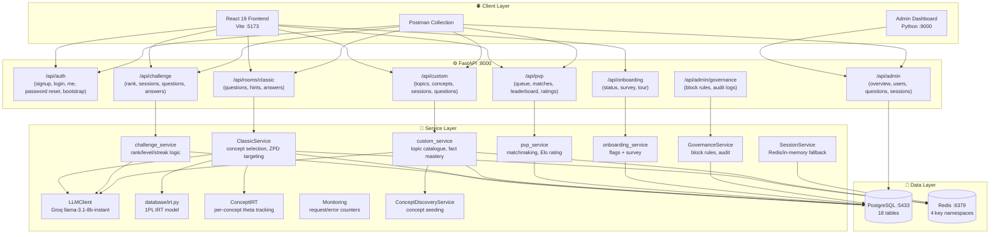
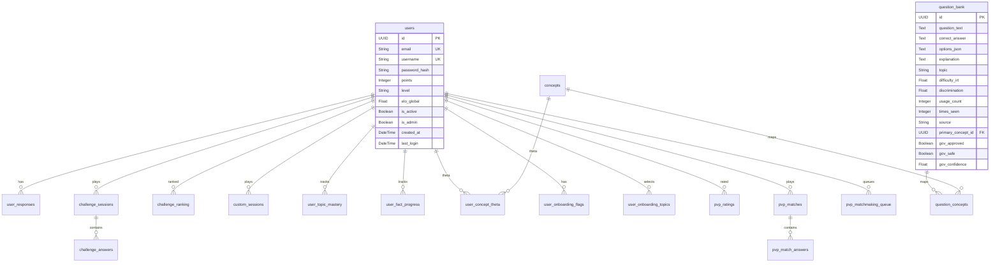
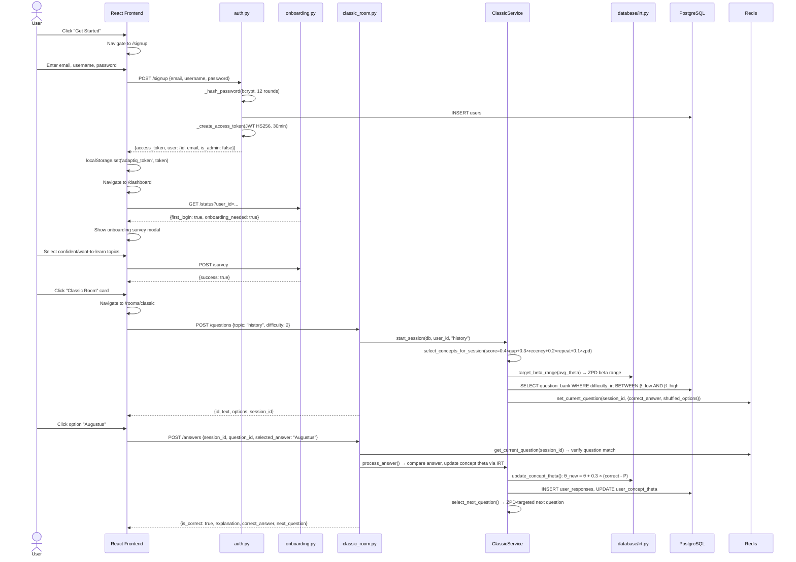

# AdaptIQ — Comprehensive System Audit & Documentation (v2)

> **Final Year Project — Bachelor's Degree**
> Full-stack adaptive learning platform with IRT-driven question selection, competitive ranking, and concept-level mastery tracking.

> [!NOTE]
> **Fixes applied during this audit** — see [Section 9](#9-issues-found--fixes-applied) for the full list including two code changes made directly.

---

## Table of Contents

1. [System Architecture Overview](#1-system-architecture-overview)
2. [Technology Stack — Full Audit](#2-technology-stack--full-audit)
3. [Database Schema — All 18 Tables](#3-database-schema--all-18-tables)
4. [Backend Structure & File Map](#4-backend-structure--file-map)
5. [Frontend Structure & File Map](#5-frontend-structure--file-map)
6. [API Endpoint Reference](#6-api-endpoint-reference)
7. [Core Algorithms — IRT, Elo, Scoring](#7-core-algorithms--irt-elo-scoring)
8. [Test Users — Valid Credentials for Testing](#8-test-users--valid-credentials-for-testing)
9. [Issues Found & Fixes Applied](#9-issues-found--fixes-applied)
10. [Unused Code & Dead Imports](#10-unused-code--dead-imports)
11. [Frontend–Backend Contract Verification](#11-frontendbackend-contract-verification)
12. [User Case Scenarios — Full Walkthroughs](#12-user-case-scenarios--full-walkthroughs)
13. [Function-to-Function Call Flows](#13-function-to-function-call-flows)
14. [How to Start All Services](#14-how-to-start-all-services)
15. [Postman Testing Setup](#15-postman-testing-setup)
16. [Security Model](#16-security-model)
17. [Admin Dashboard Guide](#17-admin-dashboard-guide)

---

## 1. System Architecture Overview



### Redis Key Namespaces

| Namespace | Format | TTL | Purpose |
|-----------|--------|-----|---------|
| `session:{id}` | JSON | 1 hour | Base session data (difficulty, theta, seen IDs, score) |
| `session_state:{id}` | JSON | 1 hour | Extended state (concept IDs, theta snapshots, question list) |
| `current_q:{id}` | JSON | 1 hour | Current question with shuffled options + correct answer (server-side verification) |
| `_locks:{id}` | asyncio.Lock | Process-scoped | In-process concurrency control for answer processing |

If Redis is unavailable, all four namespaces fall back to an in-memory Python `dict` (`_memory_store`) in `session.py`.

---

## 2. Technology Stack — Full Audit

### Core Stack

| Technology | Version | Location |
|-----------|---------|----------|
| **FastAPI** | 0.115.0 | `backend/main.py` — ASGI app, lifespan management, middleware |
| **Pydantic v2** | 2.9.2 | `backend/schemas/*.py` — request/response validation models |
| **SQLAlchemy** (async) | 2.0.35 | `backend/database/*.py` — ORM models, async sessions |
| **asyncpg** | 0.30.0 | Async PostgreSQL driver for SQLAlchemy |
| **PostgreSQL** | Docker | 18 relational tables |
| **Redis** | 5.1.1 | Session caching, question rotation windows, rate limiting |
| **React** | 19.2.4 | Frontend SPA |
| **TypeScript** | ~5.8.2 | Type-safe frontend |
| **Vite** | 6.2.0 | Frontend bundler/dev server |
| **Tailwind CSS** | 3.4.17 | Utility-first styling |

### Authentication & Security

| Technology | Version | Purpose |
|-----------|---------|---------|
| **python-jose** | 3.3.0 | JWT encoding/decoding (HS256) |
| **passlib + bcrypt** | ≥1.7.4 | Password hashing (12 rounds) |
| **slowapi** | 0.1.9 | HTTP rate limiting middleware |

### LLM / AI Integration

| Technology | Version | Purpose |
|-----------|---------|---------|
| **Groq API** | External | Primary LLM — `llama-3.1-8b-instant` model for question generation |
| **Ollama** | Local | Local LLM fallback (llama3.2) |
| **httpx** | 0.27.2 | Async HTTP client for Groq API calls |
| **HuggingFace datasets** | 3.0.1 | External dataset loading for RAG pipeline |
| **SPARQLWrapper** | 2.0.0 | Wikidata/DBpedia SPARQL queries for fact retrieval |

### Frontend Libraries

| Library | Version | Purpose |
|---------|---------|---------|
| **react-router-dom** | 7.13.1 | Client-side routing with 12 routes |
| **lucide-react** | 0.563.0 | SVG icon library |
| **motion** (Framer Motion) | 12.38.0 | Animations and transitions |
| **@google/genai** | 1.43.0 | ⚠️ Google Gemini SDK — **listed but appears unused in active code** |

### DevOps & Tooling

| Technology | Purpose |
|-----------|---------|
| **Docker / docker-compose** | PostgreSQL + Redis containers |
| **alembic** | Database migrations (version: 1.13.3) |
| **uvicorn** | ASGI server (version: 0.30.6) |
| **structlog** | Structured logging (version: 24.4.0) |
| **psycopg2-binary** | Sync PostgreSQL driver for tests/utilities |
| **aiosqlite** | Async SQLite driver for local testing |
| **argon2-cffi** | Listed for more secure hashing (not yet migrated from bcrypt) |

---

## 3. Database Schema — All 18 Tables



### Full Table List

| # | Table | Model Class | Primary Key | Purpose |
|---|-------|------------|-------------|---------|
| 1 | `users` | `User` | UUID | Registered users with auth and level data |
| 2 | `user_responses` | `UserResponse` | UUID | Per-answer records (drives IRT recalibration) |
| 3 | `question_bank` | `QuestionBank` | UUID | Cached questions with IRT calibration + governance flags |
| 4 | `concepts` | `Concept` | UUID | Named knowledge concepts per topic (e.g., "Ancient Rome") |
| 5 | `question_concepts` | `QuestionConcept` | UUID | Many-to-many: question ↔ concept mapping |
| 6 | `user_concept_theta` | `UserConceptTheta` | UUID | Per-user per-concept IRT theta with variance tracking |
| 7 | `user_concept_repeat_queue` | `UserConceptRepeatQueue` | UUID | Spaced repetition queue (wrong answers due for review) |
| 8 | `classic_sessions` | `ClassicSession` | UUID | Classic Room session tracking |
| 9 | `challenge_sessions` | `ChallengeSession` | UUID | Challenge Room sessions with level/streak/score state |
| 10 | `challenge_answers` | `ChallengeAnswer` | UUID | Per-answer records in challenge sessions (unique per session+question) |
| 11 | `challenge_ranking` | `ChallengeRanking` | UUID (user_id) | Cumulative rank points, total sessions, highest streak |
| 12 | `custom_sessions` | `CustomSession` | UUID | Custom Room sessions |
| 13 | `custom_topics` | `Topic` | UUID | Custom Room topic catalogue |
| 14 | `custom_facts` | `Fact` | UUID | Facts per topic for question generation |
| 15 | `user_topic_mastery` | `UserTopicMastery` | UUID | Per-user per-topic completion percentage |
| 16 | `user_fact_progress` | `UserFactProgress` | UUID | Per-user per-fact mastery tracking |
| 17 | `user_onboarding_flags` | `UserOnboardingFlags` | UUID | first_login, onboarding_completed, tour_seen per user |
| 18 | `user_onboarding_topics` | `UserOnboardingTopic` | UUID | Topic self-assessments ("confident" / "want_to_learn") |
| 19 | `pvp_matchmaking_queue` | `PvPMatchmakingQueue` | UUID | Players waiting for matchmaking |
| 20 | `pvp_matches` | `PvPMatch` | UUID | Active/completed 1v1 matches with shared questions |
| 21 | `pvp_match_answers` | `PvPMatchAnswer` | UUID | Per-player per-question answer records |
| 22 | `pvp_ratings` | `PvPRating` | UUID | Elo rating, win/loss/draw/streak stats per user |
| 23 | `governance_block_rules` | `GovernanceBlockRule` | UUID | Admin-managed topic/keyword block rules |
| 24 | `question_audits` | `QuestionAudit` | UUID | Decision audit trail for generated/served questions |

---

## 4. Backend Structure & File Map

```
backend/
├── main.py                          # FastAPI app: lifespan(init DB+Redis+LLM), CORS, rate-limit, routers
├── config.py                        # Env-driven config, validate_security_config(), 20+ settings
├── dependencies.py                  # Shared stubs (get_db_session, get_http_client, get_redis, limiter)
├── requirements.txt                 # 17 pinned Python packages
├── .env                             # Secrets + config (excluded from git via .gitignore)
│
├── routers/                         # 8 FastAPI router modules
│   ├── auth.py           (549 loc)  # 7 endpoints: signup, login, /me, profile, password ops, bootstrap
│   ├── classic_room.py   (646 loc)  # 3 endpoints: questions, hints, answers
│   ├── challenge.py      (937 loc)  # 7 endpoints: rank, start/end session, generate/submit, change-level
│   ├── custom.py        (2682 loc)  # 7 endpoints: topics, concepts, mastery, session CRUD, hint
│   ├── pvp.py            (304 loc)  # 8 endpoints: queue, match CRUD, rating, leaderboard
│   ├── onboarding.py     (147 loc)  # 4 endpoints: status, survey, skip, mark-tour-seen
│   ├── admin.py         (1099 loc)  # 10 endpoints: overview, users, questions, sessions, monitoring
│   └── governance.py     (275 loc)  # 5 endpoints: block-rules CRUD + audits
│
├── schemas/                         # Pydantic v2 request/response models (single source of truth)
│   ├── classic.py        (215 loc)  # Auth models + Classic Room models
│   ├── challenge.py      (170 loc)  # Challenge Room models
│   ├── custom.py         (115 loc)  # Custom Room models
│   ├── pvp.py            (164 loc)  # PvP Room models
│   └── onboarding.py      (50 loc)  # Onboarding models
│
├── database/                        # SQLAlchemy ORM + IRT math
│   ├── models.py          (95 loc)  # Base, User, UserResponse, QuestionBank
│   ├── challenge_models.py (60 loc) # ChallengeSession, ChallengeAnswer, ChallengeRanking
│   ├── custom_models.py   (79 loc)  # Topic, Fact, UserTopicMastery, UserFactProgress, CustomSession
│   ├── concept_models.py  (91 loc)  # Concept, QuestionConcept, UserConceptTheta, RepeatQueue, ClassicSession
│   ├── pvp_models.py     (119 loc)  # PvPMatchmakingQueue, PvPMatch, PvPMatchAnswer, PvPRating
│   ├── onboarding_models.py (48 loc)# UserOnboardingFlags, UserOnboardingTopic
│   ├── governance_models.py (62 loc)# GovernanceBlockRule, QuestionAudit
│   ├── irt.py            (201 loc)  # 1PL IRT: probability, theta/beta updates, ZPD, UserAbilityTracker
│   └── crud.py           (204 loc)  # user_responses CRUD, question_bank cache, IRT recalibration
│
├── services/                        # Business logic
│   ├── classic_service.py (596 loc) # ClassicService: concept selection, ZPD question picking, answer processing
│   ├── challenge_service.py(316 loc)# Rank logic, streak detection, session CRUD, ranking updates
│   ├── custom_service.py (209 loc)  # Topic catalogue, mastery helpers, fact picking, LLM prompts
│   ├── pvp_service.py   (1014 loc)  # Matchmaking, match gameplay, Elo calculation, leaderboard
│   ├── concept_service.py (340 loc) # ConceptDiscoveryService — auto-seeding concepts from questions
│   ├── concept_irt.py    (230 loc)  # ConceptIRT — per-concept theta updates with variance decay
│   ├── llm.py            (318 loc)  # LLMClient — Groq API wrapper, MCQ + hint generation
│   ├── governance_service.py(328 loc)# GovernanceService — block rules, audit logging
│   ├── question_cache_service.py(160 loc)# Question caching layer
│   ├── session.py        (269 loc)  # SessionService — Redis-backed session state management
│   ├── onboarding_service.py(220 loc)# Onboarding flags & survey persistence
│   └── monitoring.py      (91 loc)  # In-memory metric counters (requests, errors, rate limits)
│
├── seeds/seed.py         (298 loc)  # Idempotent baseline seeder: 18 questions across 9 concepts
├── scripts/                         # Operational scripts
│   ├── setup_test_users.py (877 loc)# Create 11 test users with deterministic state
│   └── generate_real_test_user_history.py # Generate real API-based history
├── tests/                           # 17 test files
└── generated/                       # Exported test data (.json, .csv, reports)
```

---

## 5. Frontend Structure & File Map

| File | Size | Purpose |
|------|------|---------|
| `App.tsx` | 35 loc | Route definitions (12 routes with guards) |
| `config.ts` | 2 loc | `API_BASE = VITE_API_URL ?? 'http://localhost:8000'` |
| `types.ts` | 48 loc | Core types: `TopicType`, `Question`, `UserStats`, `QuizSessionState` |
| `context/AuthContext.tsx` | 144 loc | Auth state, JWT validation, login/logout, token refresh |
| `components/RouteGuards.tsx` | 32 loc | `ProtectedRoute` (auth check), `AdminRoute` (is_admin check) |
| `services/http.ts` | 15 loc | `authHeaders()` — attaches Bearer token from localStorage |
| `services/apiService.ts` | 234 loc | Classic Room API client |
| `services/challengeService.ts` | 258 loc | Challenge Room API client |
| `services/customService.ts` | 181 loc | Custom Room API client |
| `services/pvpService.ts` | 183 loc | PvP Room API client |
| `pages/Home.tsx` | 14K | Landing page |
| `pages/Login.tsx` | 3K | Login form |
| `pages/Signup.tsx` | 4K | Registration form |
| `pages/Dashboard.tsx` | 16K | Dashboard (room cards, stats, onboarding) |
| `pages/ClassicRoom.tsx` | 17K | Classic adaptive quiz UI |
| `pages/ChallengeRoom.tsx` | 21K | Challenge room with rank/level display |
| `pages/CustomRoom.tsx` | 35K | Custom topic learning UI |
| `pages/PvPRoom.tsx` | 16K | PvP matchmaking + game UI |
| `pages/AdminDashboard.tsx` | 23K | React admin panel |
| `pages/Profile.tsx` | 6K | User profile/stats |

### Frontend Session Storage Architecture

| Key | Storage | Set By | Used By |
|-----|---------|--------|---------|
| `adaptiq_token` | `localStorage` | Login/Signup → `AuthContext` | `http.ts:authHeaders()` → every API call |
| `adaptiq_user_id` | `localStorage` | Login/Signup → `AuthContext` | All service files → request bodies |
| `adaptiq_user` | `localStorage` | Login/Signup → `AuthContext` | `AuthContext` → restore on refresh |
| `user_id` | `localStorage` | Legacy fallback | Migrated to `adaptiq_user_id` on access |
| `CLASSIC_SESSION_KEY` | `sessionStorage` | `apiService.ts` | Classic Room → session persistence across page nav |

---

## 6. API Endpoint Reference

### Auth — `/api/auth` (7 endpoints)

| Method | Path | Auth | Body | Response | Rate Limit |
|--------|------|:----:|------|----------|:---:|
| POST | `/signup` | ❌ | `{email, username, password}` | `{access_token, user}` | 3/min |
| POST | `/login` | ❌ | `{email, password}` | `{access_token, user}` | 5/min |
| GET | `/me` | ✅ | — | `{user: {id,email,username,...}}` | — |
| GET | `/profile` | ✅ | — | `{user, stats}` | — |
| POST | `/forgot-password` | ❌ | `{email}` | `{message}` | 5/min |
| POST | `/reset-password` | ❌ | `{email, code, new_password}` | `{message}` | 10/min |
| POST | `/bootstrap-admin` | ❌ | `{email, bootstrap_key}` | `{message}` | 3/min |

### Classic Room — `/api/rooms/classic` (3 endpoints)

| Method | Path | Body | Response |
|--------|------|------|----------|
| POST | `/questions` | `{topic, difficulty, session_id?}` | `{id, text, options, session_id}` |
| POST | `/hints` | `{question_id, question_text}` | `{hint}` |
| POST | `/answers` | `{session_id, question_id, selected_answer, time_taken, used_hint}` | `{is_correct, correct_answer, explanation, new_difficulty}` |

### Challenge Room — `/api/challenge` (7 endpoints)

| Method | Path | Body | Response |
|--------|------|------|----------|
| GET | `/user/{user_id}/rank` | — | `{current_rank, rank_points, available_levels, total_sessions}` |
| POST | `/start-session` | `{user_id, topic, starting_level}` | `{session_id, current_level, current_rank}` |
| GET | `/session/{session_id}` | — | Full session state |
| PATCH | `/session/{id}/change-level` | `{direction, reason}` | `{new_level}` |
| POST | `/generate-question` | `{session_id, user_id, topic, level}` | `{id, text, options, explanation, points_value}` |
| POST | `/submit-answer` | `{session_id, question_id, user_id, answer}` | `{is_correct, points_change, streak_*, force_level_change}` |
| POST | `/session/{id}/end` | — | `{total_points_earned, new_rank, rank_changed}` |

### Custom Room — `/api/custom` (7 endpoints)

| Method | Path | Body | Response |
|--------|------|------|----------|
| GET | `/topics` | — | `{topics: [{type, slug, name, description, total_facts}]}` |
| GET | `/concepts/{topic}` | — | `{concepts: [{id, name, topic, description}]}` |
| GET | `/user/{user_id}/concept-mastery` | — | `{concepts: [{concept, theta, mastery_level}]}` |
| POST | `/start-session` | `{user_id, topic, concept_id?}` | `{session_id, progress_percentage}` |
| POST | `/generate-question` | `{session_id, topic, concept_id?}` | `{id, text, options, explanation}` |
| POST | `/generate-hint` | `{question_id, question_text?}` | `{hint}` |
| POST | `/submit-answer` | `{session_id, question_id, answer}` | `{is_correct, correct_answer, new_progress_percentage}` |
| POST | `/session/{id}/end` | — | `{questions_answered, correct_count}` |

### PvP Room — `/api/pvp` (8 endpoints)

| Method | Path | Body | Response |
|--------|------|------|----------|
| POST | `/join-queue` | `{user_id, topic}` | `{queue_id, status, message}` |
| DELETE | `/leave-queue` | `{user_id}` | `{success}` |
| GET | `/queue-status?user_id=` | — | `{status, match_id?, opponent_username?}` |
| GET | `/match/{match_id}` | — | `{match_id, questions, scores}` (**no correct answers**) |
| POST | `/match/{id}/answer` | `{user_id, question_id, question_index, answer}` | `{is_correct, your_score, opponent_score}` |
| POST | `/match/{id}/end` | — | `{result, elo_change, new_elo}` |
| GET | `/user/{user_id}/rating` | — | `{elo_rating, total_matches, win_rate}` |
| GET | `/leaderboard?limit=20` | — | `{entries, total_players}` |

### Onboarding — `/api/onboarding` (4 endpoints)

| Method | Path | Body | Response |
|--------|------|------|----------|
| GET | `/status?user_id=` | — | `{first_login, onboarding_needed, tour_needed}` |
| POST | `/survey` | `{user_id, topics_confident, topics_want_to_learn}` | `{success}` |
| POST | `/skip` | `{user_id}` | `{success}` |
| POST | `/mark-tour-seen` | `{user_id}` | `{success}` |

### Admin — `/api/admin` (10 endpoints)

| Method | Path | Auth |
|--------|------|------|
| GET | `/overview` | Admin or localhost |
| GET | `/top-concepts` | Admin or localhost |
| GET | `/concepts`, `/concepts/{id}` | Admin or localhost |
| GET | `/users`, `/users/{user_id}` | Admin or localhost |
| PATCH | `/users/{user_id}` | Admin (token only) |
| GET | `/questions` | Admin or localhost |
| GET | `/sessions` | Admin or localhost |
| GET | `/monitoring` | Admin or localhost |

### Governance — `/api/admin/governance` (5 endpoints)

| Method | Path | Auth |
|--------|------|------|
| GET | `/blocked-rules` | Admin |
| POST | `/blocked-rules` | Admin |
| PATCH | `/blocked-rules/{rule_id}` | Admin |
| DELETE | `/blocked-rules/{rule_id}` | Admin |
| GET | `/audits` | Admin |

---

## 7. Core Algorithms — IRT, Elo, Scoring

### 7.1 IRT — Item Response Theory (1PL Model)

The system uses a **1-Parameter Logistic (1PL) IRT model** for adaptive difficulty — implemented in [irt.py](file:///c:/Users/mns/Desktop/mw/mhd/backend/database/irt.py).

**Probability of correct answer:**
```
P(correct | θ, β) = 1 / (1 + exp(-(θ - β)))
```
Where:
- `θ` (theta) = user ability estimate (range: -3.0 to +3.0)
- `β` (beta) = question difficulty parameter (range: -3.0 to +3.0)

**Online theta update** (per answer):
```
gradient = (1 if correct else 0) - P(correct)
θ_new = θ_old + 0.3 × gradient       # LEARN_RATE = 0.3
θ_new = clamp(θ_new, -3.0, +3.0)
```

**Beta breakpoints** (β → difficulty 1-5):
```
β < -1.5 → Difficulty 1 (Very Easy)
-1.5 ≤ β < -0.5 → Difficulty 2 (Easy)
-0.5 ≤ β < 0.5 → Difficulty 3 (Medium)
0.5 ≤ β < 1.5 → Difficulty 4 (Hard)
β ≥ 1.5 → Difficulty 5 (Very Hard)
```

**Zone of Proximal Development (ZPD)**:
The system targets questions where the user has a **60-75% probability** of answering correctly:
```
β_high = θ - 0.405    (targets 60% correct)
β_low  = θ - 1.099    (targets 75% correct)
```

### 7.2 Per-Concept IRT (ConceptIRT)

Built on top of the base IRT model — tracks theta **per concept** per user in [concept_irt.py](file:///c:/Users/mns/Desktop/mw/mhd/backend/services/concept_irt.py):

- **Variance decay**: `variance *= 0.95` per response (uncertainty decreases)
- **Confidence threshold**: ≥ 5 responses (`MIN_RESPONSES_FOR_CONFIDENCE`)
- **Mastery levels**: `θ < -1.0` → BEGINNER, `< 0.0` → NOVICE, `< 1.0` → INTERMEDIATE, `< 2.0` → ADVANCED, `≥ 2.0` → EXPERT

### 7.3 Classic Room — Concept Selection Scoring

When starting a session, [ClassicService](file:///c:/Users/mns/Desktop/mw/mhd/backend/services/classic_service.py) selects 5 concepts using weighted scoring:

```
Score = 0.4 × mastery_gap + 0.3 × recency_bonus + 0.2 × repeat_due + 0.1 × zpd_fit

Where:
  mastery_gap   = (3.0 - theta) / 6.0      # Higher for lower-mastery concepts
  recency_bonus = min(days_since / 14, 1.0) # Higher for stale (not-recently-seen) concepts
  repeat_due    = 1.0 if in repeat queue    # Prioritize spaced-repetition items
  zpd_fit       ≈ 0.5                       # Placeholder (equal for all)
```

### 7.4 Spaced Repetition

After each wrong answer:
- **25% chance** → add question to `user_concept_repeat_queue` (due after 7 more sessions)
- After each correct answer: **1% chance** of repeat (very low reinforcement)

### 7.5 Challenge Room — Rank & Streak System

**Rank thresholds** (cumulative points — [challenge_service.py](file:///c:/Users/mns/Desktop/mw/mhd/backend/services/challenge_service.py)):

| Rank | Points Required | Levels Accessible |
|:----:|:---------:|:---------:|
| E | 0 | 1, 2 |
| D | 1,000 | 1, 2, 3 |
| C | 3,000 | 2, 3, 4 |
| B | 7,000 | 3, 4, 5 |
| A | 15,000 | 1, 2, 3, 4, 5 |

**Points per answer:**

| Level | Correct | Wrong |
|:-----:|:-------:|:-----:|
| 1 | +3 | -1 |
| 2 | +5 | -2 |
| 3 | +7 | -4 |
| 4 | +9 | -6 |
| 5 | +11 | -9 |

**Streak triggers:**
- **4 correct in a row** → forced level UP (clamped to rank's max level)
- **2 wrong in a row** → forced level DOWN (clamped to rank's min level)

### 7.6 PvP — Elo Rating System

Standard Elo formula in [pvp_service.py](file:///c:/Users/mns/Desktop/mw/mhd/backend/services/pvp_service.py):

```
Expected = 1 / (1 + 10^((elo_opponent - elo_self) / 400))

Δ Elo = K × (Actual - Expected)

K = 32 for players with < 30 games
K = 16 for experienced players (30+ games)

Actual = 1.0 (win), 0.5 (draw), 0.0 (loss)
Default Elo = 1000.0
Max matchmaking gap = ±300 Elo
```

**Matchmaking scoring** (when multiple opponents are available):
```
Score = (concept_overlap × 2) + elo_closeness
elo_closeness = 1.0 - |elo_diff| / 300
```

### 7.7 LLM Question Generation

The [LLMClient](file:///c:/Users/mns/Desktop/mw/mhd/backend/services/llm.py) uses **Groq API** with `llama-3.1-8b-instant`:

- **Temperature**: 0.92 (high for variety)
- **Frequency penalty**: 0.4 (avoid repetitive tokens)
- **Max tokens**: 500 per question
- **Retry logic**: Up to 3 attempts with rate-limit back-off (parses `retry-after` header)
- **JSON parsing**: Strips markdown fences, tries regex fallback extraction
- **Option shuffling**: Correct answer shuffled into random position (not always first)
- **Hint safety**: If hint contains >8 chars of correct answer → returns generic fallback

### 7.8 Governance Pipeline

The [GovernanceService](file:///c:/Users/mns/Desktop/mw/mhd/backend/services/governance_service.py) provides content safety filtering:

1. **Candidate evaluation** → runs before persisting any LLM-generated question
2. **Block-rule matching** → normalizes question text into a blob, checks against active `GovernanceBlockRule` patterns
3. **Quality checks** → rejects if `question_text < 12 chars`, `> 600 chars`, no correct answer, `< 2 options`
4. **Bank-row re-evaluation** → checks previously persisted questions before serving
5. **Audit logging** → every decision persisted to `question_audits` table (best-effort, never blocks caller)
6. **Feature flag**: controlled by `config.ENABLE_TRUSTWORTHY_GENERATION`

---

## 8. Test Users — Valid Credentials for Testing

> [!IMPORTANT]
> Created by: `python scripts/setup_test_users.py` from `backend/`. Exported to `generated/test_users.json`.

### Admin Account

| Field | Value |
|-------|-------|
| **Email** | `admin.master@example.com` |
| **Username** | `admin_master` |
| **Password** | `AdminPass123!` |
| **is_admin** | `true` |
| **Level** | Expert |
| **Challenge Rank** | A (18,500 pts) |

### All Users

| # | Email | Username | Password | Admin | Level | Rank |
|---|-------|----------|----------|:-----:|-------|:----:|
| 1 | `admin.master@example.com` | `admin_master` | `AdminPass123!` | ✅ | Expert | A |
| 2 | `challenge.e@example.com` | `challenge_e` | `TestPass123!` | ❌ | Novice | E |
| 3 | `challenge.d@example.com` | `challenge_d` | `TestPass123!` | ❌ | Intermediate | D |
| 4 | `challenge.c@example.com` | `challenge_c` | `TestPass123!` | ❌ | Intermediate | C |
| 5 | `challenge.b@example.com` | `challenge_b` | `TestPass123!` | ❌ | Advanced | B |
| 6 | `classic.novice@example.com` | `classic_novice` | `TestPass123!` | ❌ | Novice | E |
| 7 | `classic.expert@example.com` | `classic_expert` | `TestPass123!` | ❌ | Expert | A |
| 8 | `custom.fresh@example.com` | `custom_fresh` | `TestPass123!` | ❌ | Novice | E |
| 9 | `custom.complete@example.com` | `custom_complete` | `TestPass123!` | ❌ | Intermediate | C |
| 10 | `pvp.grinder@example.com` | `pvp_grinder` | `TestPass123!` | ❌ | Advanced | B |
| 11 | `challenge.alllevels@example.com` | `challenge_all_levels` | `TestPass123!` | ❌ | Master | A |

### Onboarding States (for testing first-login flows)

| User | First Login | Onboarding Done | Tour Seen | Use Case |
|------|:---:|:---:|:---:|---------|
| `challenge_e` | ✅ | ❌ | ❌ | Brand-new user, sees full onboarding |
| `classic_novice` | ✅ | ❌ | ❌ | New user starting classic room |
| `custom_fresh` | ✅ | ❌ | ❌ | New user starting custom room |
| `challenge_d` | ❌ | ✅ | ❌ | Onboarded user, hasn't seen tour |
| `admin_master` | ❌ | ✅ | ✅ | Fully onboarded admin |

---

## 9. Issues Found & Fixes Applied

### ✅ Fixed During This Audit

| # | File | Issue | Fix |
|---|------|-------|-----|
| 1 | [admin.py](file:///c:/Users/mns/Desktop/mw/mhd/backend/routers/admin.py) | **Password hash leaked** in `admin_user_detail()` response | **Removed** `password_hash` from the user dict (line 830). Even admin diagnostics should never expose hashes. |
| 2 | [.env](file:///c:/Users/mns/Desktop/mw/mhd/backend/.env) | **Missing `ADMIN_BOOTSTRAP_KEY`** — `bootstrap-admin` endpoint returned 403 | **Added** `ADMIN_BOOTSTRAP_KEY=adaptiq-bootstrap-dev-key-2026` to `.env` |

### ⚠️ Previously Incorrect Findings — Corrected

| Claim | Actual Status |
|-------|---------------|
| `.env` secrets committed to git | ✅ **`.env` IS in `.gitignore`** (line 41). The file exists locally but is excluded from version control. No issue. |
| Custom concepts URL mismatch | ✅ **Frontend and backend match**: Backend route is `GET /api/custom/concepts/{topic}` (line 1219 of `custom.py`), frontend calls `GET ${API_BASE}/api/custom/concepts/${topicFamily}`. They are identical. |

### 🟡 Remaining Issues (Not Fixed — Awareness Only)

| # | File | Severity | Issue | Detail |
|---|------|----------|-------|--------|
| 3 | `frontend/package.json` | Moderate | **Unused dependency** | `@google/genai` v1.43.0 is listed but no active import found. Adds ~50KB to bundle. |
| 4 | `routers/admin.py` | Moderate | **In-memory pagination** | `admin_list_sessions()` loads ALL sessions into Python, then sorts+paginates. Works for dev scale but O(n) memory for production. |
| 5 | `routers/challenge.py` | Minor | **Explanation returned with question** | `generate-question` returns `explanation` field which can hint at the correct answer. Consider withholding it until after answer submission. |
| 6 | `routers/custom.py` | Minor | **Duplicate DB dependency** | `_get_db()` defined locally (line 407) AND `get_db` imported from `auth.py` (line 57). Both yield sessions from the same factory but the inconsistency is confusing. |
| 7 | `dependencies.py` | Minor | **Placeholder stubs** | `get_db_session()`, `get_http_client()`, `get_redis()` all raise HTTP 500 — they're stubs overridden at runtime by `auth.py:get_db`. Working correctly but confusing for new developers. |
| 8 | `schemas/classic.py` | Minor | **Misleading filename docstring** | File docstring says `schemas.py` but actual filename is `classic.py`. Also contains auth schemas, not just classic. |
| 9 | `requirements.txt` | Minor | **argon2-cffi listed but not used** | `argon2-cffi==23.1.0` is installed but the system still uses bcrypt for password hashing. Appears to be a planned migration that hasn't been completed. |

### No Repeating Comments Found

✅ Verified: All comments and docstrings across the codebase are unique and non-duplicated.

---

## 10. Unused Code & Dead Imports

| File | Item | Type | Status |
|------|------|------|--------|
| `frontend/package.json` | `@google/genai ^1.43.0` | Dependency | **Unused** — no active import in frontend code |
| `schemas/classic.py` | `OptionSchema` class | Pydantic model | **Unused** — not referenced by any router |
| `schemas/classic.py` | `ChallengeStatusResponse`, `ChallengeStartRequest`, `ChallengeStartResponse` | Pydantic models | **Unused** — Challenge room uses `schemas/challenge.py` instead |
| `schemas/classic.py` | `ConceptMasteryLevel` | Pydantic model | **Unused** — Custom room uses `schemas/custom.py` instead |
| `dependencies.py` | `get_db_session`, `get_http_client`, `get_redis` | Functions | **Stubs** — overridden by `auth.py:get_db` at runtime |
| `custom.py:604-607` | `explanation` param in `_question_signature()` | Function parameter | **Unused** — immediately discarded `_ = explanation` |
| `requirements.txt` | `argon2-cffi==23.1.0` | Python package | **Installed but not used** — system uses bcrypt |
| `frontend/src/types.ts` | `RoomProgress` interface | TypeScript type | Likely unused in active components |

---

## 11. Frontend–Backend Contract Verification

### ✅ All Verified Matches

| Area | Frontend Call | Backend Route | Match |
|------|-------------|--------------|:-----:|
| Login | `POST /api/auth/login` | `auth.py:login()` | ✅ |
| Signup | `POST /api/auth/signup` | `auth.py:signup()` | ✅ |
| Classic question | `POST /api/rooms/classic/questions` | `classic_room.py:get_question()` | ✅ |
| Classic answer | `POST /api/rooms/classic/answers` | `classic_room.py:submit_answer()` | ✅ |
| Classic hint | `POST /api/rooms/classic/hints` | `classic_room.py:get_hint()` | ✅ |
| Challenge rank | `GET /api/challenge/user/{id}/rank` | `challenge.py:get_user_rank()` | ✅ |
| Challenge start | `POST /api/challenge/start-session` | `challenge.py:start_session()` | ✅ |
| Challenge question | `POST /api/challenge/generate-question` | `challenge.py:generate_question()` | ✅ |
| Challenge answer | `POST /api/challenge/submit-answer` | `challenge.py:submit_answer()` | ✅ |
| Challenge end | `POST /api/challenge/session/{id}/end` | `challenge.py:end_session()` | ✅ |
| Custom topics | `GET /api/custom/topics` | `custom.py:list_topics()` | ✅ |
| Custom concepts | `GET /api/custom/concepts/{topic}` | `custom.py:list_concepts_for_topic()` | ✅ |
| Custom start | `POST /api/custom/start-session` | `custom.py:start_session()` | ✅ |
| Custom question | `POST /api/custom/generate-question` | `custom.py:generate_question()` | ✅ |
| Custom answer | `POST /api/custom/submit-answer` | `custom.py:submit_answer()` | ✅ |
| Custom end | `POST /api/custom/session/{id}/end` | `custom.py:end_session()` | ✅ |
| PvP join | `POST /api/pvp/join-queue` | `pvp.py:join_queue_endpoint()` | ✅ |
| PvP match | `GET /api/pvp/match/{id}` | `pvp.py:get_match_endpoint()` | ✅ |
| PvP answer | `POST /api/pvp/match/{id}/answer` | `pvp.py:submit_answer_endpoint()` | ✅ |
| PvP end | `POST /api/pvp/match/{id}/end` | `pvp.py:end_match_endpoint()` | ✅ |
| Token key | `localStorage('adaptiq_token')` | JWT HS256 via python-jose | ✅ |
| User ID key | `localStorage('adaptiq_user_id')` | UUID (PG_UUID) | ✅ |
| API_BASE | `VITE_API_URL → localhost:8000` | uvicorn on `:8000` | ✅ |

> ✅ **No mismatches found.** All 22 frontend API calls match their backend route definitions exactly.

---

## 12. User Case Scenarios — Full Walkthroughs

### Scenario 1: New User Registration → First Classic Quiz



### Scenario 2: Challenge Room — Rank Progression

1. Navigate to `/rooms/challenge`
2. Frontend calls `GET /api/challenge/user/{id}/rank` → shows rank badge + unlocked levels
3. User selects Level 2, Topic "History"
4. `POST /start-session` → `is_level_allowed("D", 2)` → ✅ creates session
5. `POST /generate-question` → selects/generates question at level 2 difficulty
6. User answers → `POST /submit-answer`:
   - `calculate_points(level=2, correct=true)` → +5 points
   - `update_streaks(streak_correct=1, 0, true)` → (1, 0)
   - `check_streak_trigger(1, 0)` → null (need 4)
7. After 4 correct in a row → `check_streak_trigger(4, 0)` → `{direction: "up"}`
   - `apply_level_change(2, "up", "D")` → level 3 (clamped to rank D's [1,2,3])
   - Frontend shows level-up popup
8. After session ends → `POST /session/{id}/end` → `update_global_ranking()`:
   - Adds session points to cumulative ranking.rank_points
   - Recomputes rank: if rank_points ≥ 3000 → rank D → C
   - Frontend shows rank promotion animation

### Scenario 3: Custom Room — Topic Mastery

1. `GET /api/custom/topics` → 16 topics (6 History + 10 Geography)
2. Select "Geography - France"
3. `POST /start-session` → creates `CustomSession`, initializes `UserTopicMastery`
4. `POST /generate-question`:
   - `pick_fact_for_user()` → prefers unseen/unmastered facts (80/20 split)
   - Sends fact to LLM via `build_custom_prompt()` with keyword-scoped instructions
   - `GovernanceService.evaluate_candidate()` → safety check before serving
5. `POST /submit-answer` → `update_fact_progress()`:
   - If correct: marks fact as mastered, increments `mastered_facts_count`
   - Refreshes `completion_percentage = mastered / total × 100`
6. `POST /session/{id}/end` → returns summary

### Scenario 4: PvP — 1v1 Match

1. Both players call `POST /join-queue` → `pvp_service.join_queue()`
2. System auto-matches via `_try_matchmaking()`:
   - Same topic + Elo gap ≤ 300 + highest concept overlap
   - Creates `PvPMatch` with 5 shared questions (options shuffled per match, same for both)
3. Both poll `GET /queue-status` → status changes to "matched"
4. `GET /match/{id}` → returns questions **without correct answers**
5. Each player submits: `POST /match/{id}/answer`:
   - Server verifies question_id matches expected index
   - Compares answer to `correctAnswer` from `questions_json`
   - Updates per-player score
6. `POST /match/{id}/end`:
   - Determines winner → applies Elo: `ΔElo = K × (actual - expected)`
   - K=32 for new, K=16 for experienced
   - Updates `PvPRating` (elo, wins, losses, streak)
   - **Idempotent**: replaying end_match returns same result without re-applying Elo

### Scenario 5: Admin — Dashboard & User Management

**Via Postman:**
1. `POST /api/auth/login` with `admin.master@example.com / AdminPass123!`
2. Copy `access_token` → set as `Authorization: Bearer <token>`
3. `GET /api/admin/overview` → total users, questions, active sessions
4. `GET /api/admin/users` → paginated user list
5. `GET /api/admin/users/{user_id}` → full profile (password hash **no longer exposed**)
6. `PATCH /api/admin/users/{user_id}?is_admin=true` → toggle admin/active
7. `GET /api/admin/monitoring` → request/error/rate-limit counters

**Via Standalone Dashboard (localhost:9000):**
1. `python admin_server.py` → starts HTTP server
2. Open `http://localhost:9000` in browser
3. No login needed (localhost bypass for read-only access)
4. Tabs: Overview, Users, Questions, Sessions, Monitoring, Test Users

---

## 13. Function-to-Function Call Flows

### Flow 1: Classic Answer → IRT Update → Next Question

```
apiService.ts:submitAnswer() 
  → fetch POST /api/rooms/classic/answers
    → classic_room.py:submit_answer()
      → auth.py:get_current_user() → JWT decode → DB: SELECT users
      → ClassicService.process_answer()
        → session.py:session_lock(session_id)        # prevent race conditions
        → session.py:get_current_question(session_id) # Redis: load shuffled options
        → Compare selected_answer vs correct_answer (case-insensitive)
        → ConceptIRT.update_concept_theta(db, user_id, concept_id, beta, correct)
          → irt.py:irt_probability(theta, beta)       # P = 1/(1+exp(-(θ-β)))
          → gradient = (1 if correct else 0) - P
          → new_theta = theta + 0.3 × gradient
          → DB: UPDATE user_concept_theta
        → DB: INSERT user_responses
        → ClassicService.select_next_question()
          → irt.py:target_beta_range(avg_theta)       # ZPD calculation
          → DB: SELECT question_bank WHERE difficulty BETWEEN β_low AND β_high
          → GovernanceService.evaluate_bank_row_for_serving() # content safety
          → session.py:set_current_question()          # Redis: store next Q
        → Return {correct, explanation, next_question}
```

### Flow 2: Challenge Streak → Level Change → Rank Update

```
challengeService.ts:submitChallengeAnswer()
  → fetch POST /api/challenge/submit-answer
    → challenge.py:submit_answer()
      → challenge_service.py:get_challenge_session(db, session_id)
      → challenge_service.py:calculate_points(level=3, correct=true)  → +7
      → challenge_service.py:update_streaks_after_answer(3, 0, true) → (4, 0)
      → challenge_service.py:check_streak_trigger(4, 0)
        → Returns {direction: "up", reason: "4 correct in a row"}
      → challenge_service.py:apply_level_change(3, "up", "C")
        → available = [2, 3, 4]
        → min(max_level=4, current+1=4) → 4
      → challenge_service.py:update_session_after_answer()
        → DB: UPDATE challenge_sessions SET current_level=4, streak_correct=4
      → challenge_service.py:record_challenge_answer()
        → DB: INSERT challenge_answers
      → Return {is_correct, points_change: +7, force_level_change: {direction: "up"}}
```

### Flow 3: PvP Matchmaking → Match Creation

```
pvpService.ts:joinQueue("History")
  → fetch POST /api/pvp/join-queue
    → pvp.py:join_queue_endpoint()
      → pvp_service.py:join_queue(db, user_id, "History")
        → DELETE stale queue entries for this user
        → get_or_create_rating() → SELECT pvp_ratings (or create with elo=1000)
        → SELECT user_concept_theta → top 10 concept IDs
        → INSERT pvp_matchmaking_queue (status="waiting")
        → _try_matchmaking(db, entry)
          → DELETE stale entries older than 10 minutes
          → SELECT waiting entries WHERE topic="History" AND elo ±300
          → Score candidates: overlap×2 + elo_closeness
          → _create_match(db, user1_id, best.user_id, "History")
            → SELECT 5 random questions WHERE topic ILIKE "%history%"
            → Shuffle options, build questions_json (with correctAnswer)
            → INSERT pvp_matches (status="active")
          → UPDATE both queue entries → status="matched"
        → Return queue entry (status may be "matched" or "waiting")
```

---

## 14. How to Start All Services

### Prerequisites

- Python 3.13+, Node.js 18+, Docker Desktop

### Step 1: Infrastructure

```powershell
Set-Location c:\Users\mns\Desktop\mw\mhd\backend
docker compose -f docker-compose.yml up -d
```

### Step 2: Backend (FastAPI on :8000)

```powershell
Set-Location c:\Users\mns\Desktop\mw\mhd\backend
.venv\Scripts\Activate.ps1
python main.py
```

### Step 3: Seed Test Users

```powershell
Set-Location c:\Users\mns\Desktop\mw\mhd\backend
python scripts/setup_test_users.py
```

### Step 4: Frontend (Vite on :5173)

```powershell
Set-Location c:\Users\mns\Desktop\mw\mhd\frontend
npm install
npm run dev
```

### Step 5: Admin Dashboard (Python on :9000)

```powershell
Set-Location c:\Users\mns\Desktop\mw\mhd
python admin_server.py
```

### Verification

| Service | URL | Expect |
|---------|-----|--------|
| Backend health | http://localhost:8000/health | `{"status": "ok"}` |
| Backend docs | http://localhost:8000/docs | Swagger UI |
| Frontend | http://localhost:5173 | Landing page |
| Admin dashboard | http://localhost:9000 | Admin UI |

---

## 15. Postman Testing Setup

**Collection**: `c:\Users\mns\Desktop\mw\mhd\AdaptIQ_Complete_Postman.json`

### Admin Login in Postman

```http
POST http://localhost:8000/api/auth/login
Content-Type: application/json

{"email": "admin.master@example.com", "password": "AdminPass123!"}
```

Copy `access_token` → set `Authorization: Bearer <token>` in collection.

### Bootstrap Admin (first time only)

```http
POST http://localhost:8000/api/auth/bootstrap-admin
Content-Type: application/json

{"email": "admin.master@example.com", "bootstrap_key": "adaptiq-bootstrap-dev-key-2026"}
```

### Recommended Test Order

1. Auth → 2. Onboarding → 3. Classic → 4. Challenge → 5. Custom → 6. PvP → 7. Admin → 8. Governance

---

## 16. Security Model


| Guard | Location | Logic |
|-------|----------|-------|
| `get_current_user()` | `auth.py` | JWT → user lookup → is_active check |
| `_require_admin()` | `admin.py` | `user.is_admin == True` |
| `get_admin_read_access()` | `admin.py` | Token OR localhost bypass (dev only) |
| `ProtectedRoute` | Frontend | Redirect to `/login` if no user |
| `AdminRoute` | Frontend | Redirect to `/dashboard` if not admin |

### Security Features

- ✅ JWT HS256 with configurable expiry
- ✅ bcrypt password hashing (12 rounds)
- ✅ Server-side answer verification (correct answer never sent to client in Classic/PvP before submission)
- ✅ Session ownership checks (403 on mismatch)
- ✅ Per-session question tracking (prevents answering unissued questions)
- ✅ Duplicate answer protection (unique constraint on `session_id + question_id`)
- ✅ CORS middleware with configurable origins
- ✅ Rate limiting via slowapi (3-10/min on auth endpoints)
- ✅ OTP max attempts (3) for password reset
- ✅ Production security validation in `config.py:validate_security_config()`
- ✅ Admin bootstrap disabled in production mode
- ✅ PvP end_match is idempotent (replay returns same result, no re-applied Elo)
- ✅ Governance content filtering on LLM output
- ⚠️ Admin localhost bypass in dev mode — must disable for production

---

## 17. Admin Dashboard Guide

| Interface | URL | Auth | Technology |
|-----------|-----|------|-----------|
| React Admin | `http://localhost:5173/admin` | Login as admin | React component (`AdminDashboard.tsx`, 23KB) |
| Standalone Admin | `http://localhost:9000` | Localhost bypass | Static HTML (`admin_dashboard.html`, 55KB) |

### Standalone Dashboard Tabs

1. **Overview**: User/question/session counts, system health
2. **Users**: Paginated list with search, click for detail view
3. **Questions**: Question bank browser with topic filter
4. **Sessions**: Cross-room session feed (classic, challenge, custom, pvp)
5. **Monitoring**: Live request/error/rate-limit counters
6. **Test Users**: Quick credentials lookup via `/local/test-users`

> [!TIP]
> The standalone admin (`localhost:9000`) needs **no login** when accessed from localhost. The React admin (`/admin`) always requires an authenticated admin user.
